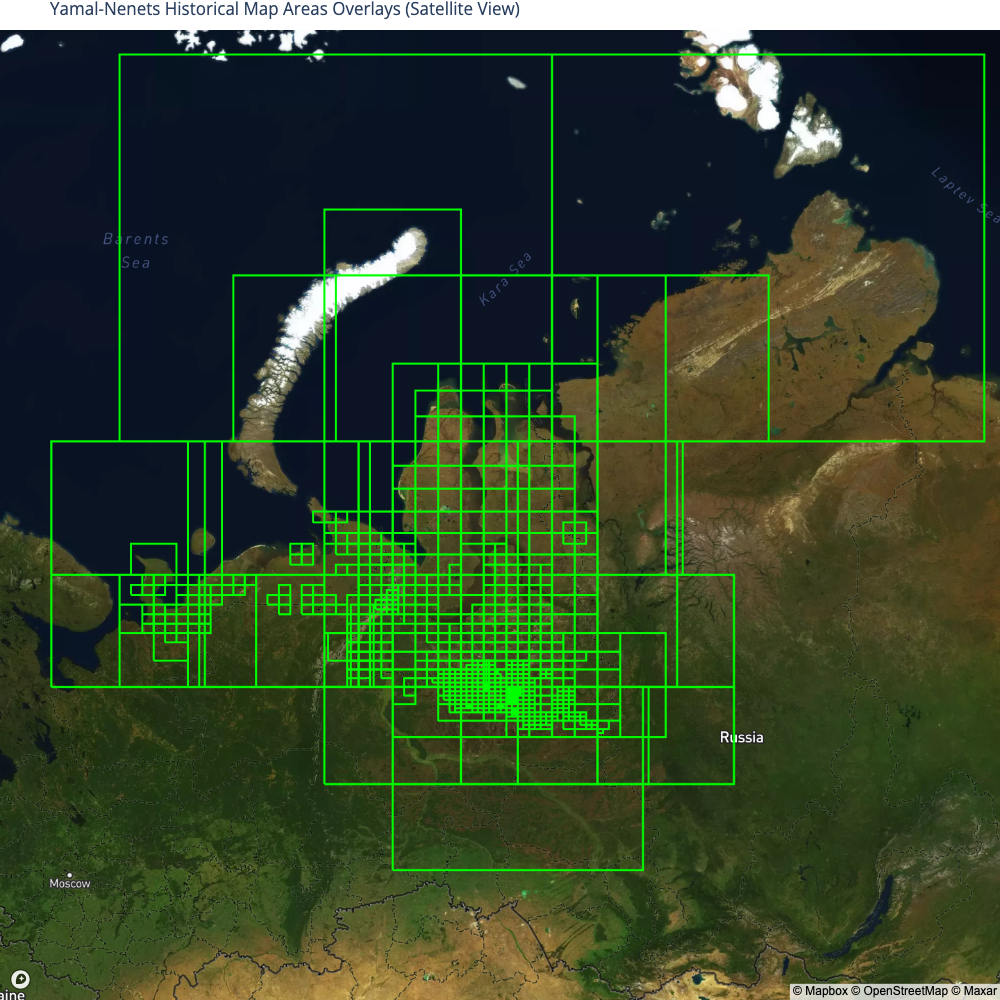
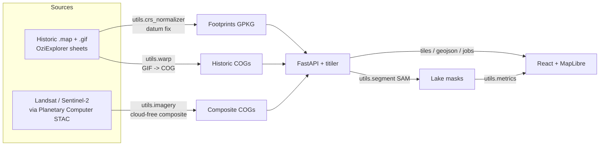

# Tundra Historic Map Portal

A web portal for studying **Arctic tundra lake change** by combining georeferenced
historic Soviet topographic maps with modern cloud-free satellite imagery. Users
select a region of interest, the system extracts overlapping historic and modern
imagery (tracking dates), segments lakes with a neural network, and computes
morphometric change metrics (area, perimeter, boundary fractal dimension, …).

Region covered: **Yamal-Nenets, Russian Arctic** (extensible to other regions).



## Contents

- [Architecture](#architecture)
- [Repository layout](#repository-layout)
- [Quick start (local dev)](#quick-start-local-dev)
- [Data](#data)
- [One-time preprocessing](#one-time-preprocessing)
- [Running the apps](#running-the-apps)
- [Deployment](#deployment)
- [How it works](#how-it-works)

## Architecture



The API and the dynamic COG tile server (titiler) run in one FastAPI process;
the React frontend talks only to that service.

## Repository layout

```
.
├── utils/                    # core Python library (import as `utils`)
│   ├── metadata_collector.py #   parse OziExplorer .map calibration files
│   ├── crs_normalizer.py     #   datum -> WGS84 (Pulkovo 1942 fix) + datum_status
│   ├── warp.py               #   historic GIF -> datum-corrected COG (needs gdal-bin)
│   ├── qa_report.py          #   georeferencing QA + footprint GPKG export
│   ├── imagery.py            #   STAC search + cloud-free composites (Landsat/S2)
│   ├── segment.py            #   SAM lake segmentation, constrained to water
│   └── metrics.py            #   area / perimeter / fractal dimension / size dist
├── services/api/             # FastAPI backend + titiler tiles (main, config, jobs)
├── web/                      # React + Vite + TypeScript + MapLibre frontend
├── streamlit_app/            # legacy sheet-coverage viewer (Streamlit)
├── notebooks/                # exploration/ and training/ notebooks (reference)
├── docs/                     # data-layout.md, deployment.md
├── docker-compose.yml        # web + api (GPU) stack
├── requirements.txt          # Python deps for a .venv
├── requirements-dev.txt      # + notebooks/dev extras
└── .env.example              # runtime configuration template
```

Data directories (`map/`, `data/`) are **not** in the repo — see [Data](#data).

## Quick start (local dev)

Prerequisites: **Python 3.12** (or [`uv`](https://docs.astral.sh/uv/), which will
fetch it for you), **Node ≥ 20**, and (for regenerating historic COGs only) system
GDAL. A CUDA GPU is recommended for SAM segmentation.

The Python side runs from a plain **`.venv`** — no conda/mamba required. The
geospatial wheels (`rasterio`, `fiona`, `pyproj`) bundle their own GDAL/GEOS/PROJ,
so pip alone is enough for the API and all processing code.

```bash
# 1. clone + enter
git clone <your-remote-url> tundra-portal && cd tundra-portal

# 2. Python environment
uv venv --python 3.12 .venv    # uv fetches CPython 3.12 if you don't have it
uv pip install -r requirements.txt
source .venv/bin/activate      # or prefix commands with .venv/bin/
# GDAL CLI only if you will run utils/warp.py:
#   sudo apt-get install -y gdal-bin

# 3. configuration
cp .env.example .env          # edit paths / API key

# 4. provide the data (see docs/data-layout.md), then:
#    backend
uvicorn services.api.main:app --host 0.0.0.0 --port 8000    # docs at /docs

# 5. frontend (separate shell)
cd web
npm install
npm run dev                    # http://localhost:5173  (proxies to :8000)
```

<details>
<summary>Don't have <code>uv</code>? / prefer stock <code>venv</code>?</summary>

[uv](https://docs.astral.sh/uv/) is a single static binary and is the easiest way
to get Python 3.12 when your distro ships something older (Ubuntu 22.04 ships
3.10, which is **too old** — `numpy==2.3.4` requires ≥ 3.11):

```bash
curl -LsSf https://astral.sh/uv/install.sh | sh    # installs to ~/.local/bin
```

With an existing Python 3.12 on `PATH`, stock tooling works identically:

```bash
python3.12 -m venv .venv
source .venv/bin/activate
pip install --upgrade pip
pip install -r requirements.txt
```

For notebook/dev extras (JupyterLab), use `requirements-dev.txt` instead.

</details>

### Verifying the environment

Datum correctness depends on PROJ finding its database, so it is worth confirming
the shift is actually being applied:

```bash
.venv/bin/python -c "
from pyproj import Transformer, Geod
t = Transformer.from_crs('EPSG:4284', 'EPSG:4326', always_xy=True)   # Pulkovo 1942 -> WGS84
x, y = t.transform(68.5, 66.9)
print('shift:', round(Geod(ellps='WGS84').inv(68.5, 66.9, x, y)[2], 1), 'm')"
# expect ~108 m. A shift of ~0 m means PROJ's database was not found.
```

> **On `PROJ_DATA` / `PROJ_LIB`:** the `.venv` needs neither — the wheels carry
> their own PROJ database. `pyproj` always prefers its bundled copy and ignores
> the variables; `rasterio`/GDAL *does* honour them, and will fail loudly
> (`Cannot find proj.db`) if they point somewhere invalid. If you also use the
> `geo` conda env, which requires them, prefer setting them per-shell rather than
> in your profile — a stale path is the one way to break PROJ here.

## Data

Large datasets are provided/moved **separately** (they are gitignored). The code
resolves paths from `.env` (see `services/api/config.py`); defaults expect this
layout at the repo root:

```
map/Yamal-Nenets/                     # historic sources + footprints
  <pack>/maps/*.map, *.gif            #   OziExplorer sheets
  map_footprints_wgs84.gpkg           #   datum-corrected footprints (generated)
data/                                 # (symlink to your store, e.g. /mnt/memory/Tundra)
  historic_cog/Yamal-Nenets/*.tif     #   warped historic COGs (generated)
  composites/…                        #   cloud-free composite COGs (generated)
  cache/composites/…                  #   API composite cache
  models/sam/sam_vit_h_*.pth          #   SAM weights (auto-downloaded on first use)
```

Full details and how to point the app at your store: **[docs/data-layout.md](docs/data-layout.md)**.

## One-time preprocessing

If regenerating from raw `.map` / `.gif` sources (the shipped data already has these):

```bash
# 1. datum-corrected footprints + georeferencing QA report
python -m utils.qa_report --base map/Yamal-Nenets --export

# 2. warp every historic sheet GIF into a datum-corrected COG (needs gdal-bin)
python -m utils.warp --batch --base map/Yamal-Nenets \
    --out data/historic_cog/Yamal-Nenets --jobs 8
```

## Running the apps

| App | Command | URL |
|-----|---------|-----|
| API + tiles | `uvicorn services.api.main:app --port 8000` | http://localhost:8000/docs |
| Web portal (dev) | `cd web && npm run dev` | http://localhost:5173 |
| Streamlit coverage viewer | `streamlit run streamlit_app/app.py` | http://localhost:8501 |

All commands run from the repo root (so `import utils` and relative `map/`/`data/`
paths resolve) with the `.venv` active — either `source .venv/bin/activate` first,
or prefix with `.venv/bin/` (e.g. `.venv/bin/uvicorn …`).

## Deployment

Containerized stack (GPU host + NVIDIA Container Toolkit):

```bash
TUNDRA_API_KEY=changeme docker compose up --build   # portal at http://localhost:8080
```

Server transfer, data mounting, and reverse-proxy notes: **[docs/deployment.md](docs/deployment.md)**.

## How it works

1. **Datum correction** — OziExplorer `.map` sheets declare `Pulkovo 1942` or
   `WGS 84` datums. `utils/crs_normalizer.py` applies the correct (deterministic)
   datum transform — fixing a ~105 m inconsistency — and tags each footprint with
   a `datum_status`.
2. **Warping** — `utils/warp.py` warps each historic GIF to a datum-corrected,
   neatline-cropped Cloud-Optimized GeoTIFF (EPSG:3857) using its control points.
3. **Modern imagery** — `utils/imagery.py` builds cloud-free median composites
   from Landsat/Sentinel-2 via the Microsoft Planetary Computer STAC API.
4. **Segmentation** — `utils/segment.py` runs the Segment Anything Model,
   seeded/constrained by an MNDWI water index, to delineate lakes.
5. **Metrics** — `utils/metrics.py` computes per-lake area, perimeter, boundary
   fractal dimension (box-counting), counts, and size distributions.
6. **Portal** — the React + MapLibre app ties selection → extraction → segmentation
   → metrics into one workflow.

## License

See the upstream data providers for imagery/map licensing. Add a project license
before publishing.
